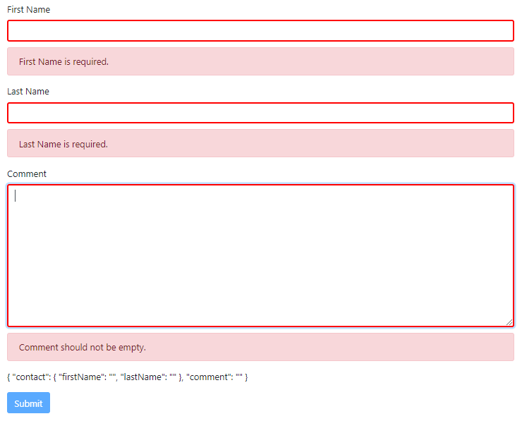

# Angular - Template Driven Form Sample Project

A powerful implementation of Angular Template Driven Form. NgForm usage, form validations by directives and showing related  error messages can be seen through a Bootstrap form.

Let's consider a feedback form that receives user's comment and information. There are two input fields ( for first name and last name) and a text area ( for comment ) here. None of fields should be empty, first name and last name fields should be minimum 2 characters.

All of the above restrictions and validations has been made in the template. This is a great feature of Angular to way create forms easier, with less code and simple validations.

When we apply NgModel attribute along with the name attribute, Angular automatically creates an instance of FormControl Class and associated it with related field. And all validations are made by this class. By using NgForm, we can check out all validations in form ( This feature was used to activate "Submit" button). Also can get all input values as JSON to send service easily.

Here are some screenshots :

